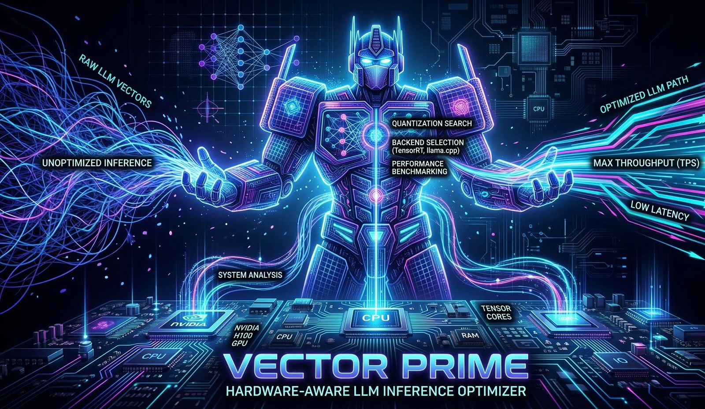

<p align="center">
  <pre align="center">
 ██╗   ██╗███████╗ ██████╗████████╗ ██████╗ ██████╗ ██████╗ ██████╗ ██╗███╗   ███╗███████╗
 ██║   ██║██╔════╝██╔════╝╚══██╔══╝██╔═══██╗██╔══██╗██╔══██╗██╔══██╗██║████╗ ████║██╔════╝
 ██║   ██║█████╗  ██║        ██║   ██║   ██║██████╔╝██████╔╝██████╔╝██║██╔████╔██║█████╗
 ╚██╗ ██╔╝██╔══╝  ██║        ██║   ██║   ██║██╔══██╗██╔═══╝ ██╔══██╗██║██║╚██╔╝██║██╔══╝
  ╚████╔╝ ███████╗╚██████╗   ██║   ╚██████╔╝██║  ██║██║     ██║  ██║██║██║ ╚═╝ ██║███████╗
   ╚═══╝  ╚══════╝ ╚═════╝   ╚═╝    ╚═════╝ ╚═╝  ╚═╝╚═╝     ╚═╝  ╚═╝╚═╝╚═╝     ╚═╝╚══════╝
  </pre>
</p>

<p align="center">
  <strong>Compiler-style, hardware-aware LLM inference optimizer</strong>
</p>

<p align="center">
  
  <a href="https://pypi.org/project/vectorprime/">
    
  </a>
  <a href="https://pypi.org/project/vectorprime/">
    
  </a>
  <a href="LICENSE"></a>
  <a href="https://github.com/TheRadDani/llm-forge/actions"></a>
  <a href="https://github.com/TheRadDani/llm-forge/stargazers"></a>
  <a href="https://github.com/TheRadDani/llm-forge/pulls"></a>
</p>

---

<p align="center">
  
</p>

VectorPrime takes a model file and your hardware, then finds the fastest way to run it. It profiles your CPU, GPU, and RAM; parses the model's intermediate representation to extract architecture metadata; generates every valid combination of runtime, quantization, thread count, and GPU offload layers; benchmarks candidates in parallel; and hands you back the configuration that maximizes tokens per second within your memory budget. The result is a ready-to-use Ollama bundle — no guesswork required.

VectorPrime is built for developers and researchers who run inference locally and want reproducible, hardware-specific performance without manually tuning runtime flags or hunting for the right quantization format. The Rust backend handles parallel benchmarking and hardware detection; a PyO3 native extension exposes everything through a clean Python API and a single `pip install vectorprime`.

---

## Features

| Feature | Description | Status |
|---|---|---|
| Hardware profiling | Detects CPU core count, SIMD level (AVX/AVX2/AVX512), GPU VRAM and compute capability, and available RAM | Stable |
| Model IR analysis | Reads GGUF and ONNX model files to extract parameter count, architecture, context length, layer count, hidden size, attention heads, KV cache size, memory footprint, and FLOPs without running inference | Stable |
| Multi-runtime support | Benchmarks Ollama (primary), TensorRT (primary), ONNX Runtime (secondary), and llama.cpp (deprioritized) against each other on your hardware | Stable |
| Automatic quantization selection | Evaluates F16, Q8\_0, Q4\_K\_M, Q4\_0, Int8, and Int4 and picks the fastest that fits in memory | Stable |
| Parallel benchmarking | Tokio-based async executor runs up to 3 configurations concurrently | Stable |
| Optimization result caching | Caches results to `~/.llmforge/cache/` keyed by model identity and hardware profile; skips benchmarking entirely on a cache hit | Stable |
| Ollama export | Generates a `Modelfile` with tuned `num_thread` and `num_gpu` values, ready for `ollama create` | Stable |
| Format conversion | Bidirectional GGUF-to-ONNX and ONNX-to-GGUF conversion with full metadata round-trip | Stable |
| Python API | PyO3 native extension — import and call from any Python script or notebook | Stable |
| CLI interface | `profile` (with `--json`, `--verbose`, `--save`), `optimize`, `convert-to-onnx`, `convert-to-gguf`, and `doctor` subcommands | Stable |

---

## Quick Start

```bash
pip install vectorprime

# See what hardware VectorPrime detected
vectorprime profile

# Find the best inference configuration for a model
vectorprime optimize model.gguf

# Export the result as an Ollama bundle (Python API)
# See the Python API section below
```

---

## Installation

### For Users

```bash
pip install vectorprime
```

No Rust toolchain required! Pre-built wheels are available for:
- Python 3.9, 3.10, 3.11, 3.12
- Linux (x86-64, Arm64), macOS (x86-64, Arm64), Windows (x86-64)

**Requirements:**
- Python 3.9 or later
- At least one supported inference runtime installed and on `PATH`

**Optional runtime prerequisites:**

```bash
# Ollama — recommended for most users
# https://ollama.com/download

# ONNX Runtime
pip install onnxruntime          # CPU
pip install onnxruntime-gpu      # CUDA GPU

# TensorRT (NVIDIA only, compute capability >= 7.0)
# https://developer.nvidia.com/tensorrt

# llama.cpp (provides llama-cli and llama-quantize)
# https://github.com/ggml-org/llama.cpp
```

VectorPrime detects which runtimes are available at startup and silently skips any whose binary is not found. `vectorprime profile` works with no runtimes installed.

---

## Usage

### Profile Hardware

```bash
vectorprime profile
```

Prints a human-readable hardware summary to stdout:

```
VectorPrime Hardware Profile
────────────────────────────────────────

CPU
  Model:                 Intel Core i9-14900HX
  Cores:                 32 threads
  SIMD Support:          AVX2

GPU
  Model:                 NVIDIA GeForce RTX 4090 Laptop GPU
  Vendor:                NVIDIA
  VRAM:                  16.0 GB
  Compute Capability:    8.9
  Tensor Cores:          Yes

Memory
  Total RAM:             31.9 GB
  Available RAM:         29.9 GB

Acceleration Support
  ✓ GPU inference available
  ✓ FP16 supported
  ✓ INT8 supported
  ✓ TensorRT compatible

Recommended Inference Setup
  Runtime:               TensorRT / llama.cpp
  Precision:             FP16 or INT8
  Estimated Model Capacity:
      • ~70B quantized
      • ~13B full GPU

Tip: run `vectorprime profile --verbose` for full hardware diagnostics.
```

**Options:**

```
vectorprime profile [OPTIONS]

Options:
  --json        Output the full hardware profile as structured JSON to stdout.
  --verbose     Show a detailed hardware diagnostic report including clock speed,
                SIMD features, CUDA/driver versions, runtime compatibility, and
                optimization hints.
  --save PATH   Save the JSON profile to a file. Can be combined with --json to
                print JSON to stdout and save to a file simultaneously.
```

#### JSON output (`--json`)

```bash
vectorprime profile --json
```

```json
{
  "cpu": {
    "brand": "Intel(R) Core(TM) i9-14900HX",
    "core_count": 32,
    "simd_level": "AVX2"
  },
  "gpu": {
    "name": "NVIDIA GeForce RTX 4090 Laptop GPU",
    "vendor": "Nvidia",
    "vram_mb": 16376,
    "compute_capability": [8, 9],
    "tensor_cores": true
  },
  "ram": {
    "total_mb": 31941,
    "available_mb": 29935
  },
  "capabilities": {
    "gpu_inference": true,
    "fp16": true,
    "int8": true,
    "tensorrt_supported": true,
    "tensor_cores": true
  },
  "recommendation": {
    "preferred_runtime": ["TensorRT", "llama.cpp"],
    "preferred_precision": ["FP16", "INT8"]
  }
}
```

#### Save to file (`--save`)

```bash
vectorprime profile --save hw.json
# Hardware profile saved to: hw.json

vectorprime profile --json --save hw.json
# Prints JSON to stdout AND saves to hw.json
```

#### Verbose diagnostics (`--verbose`)

```bash
vectorprime profile --verbose
```

```
VectorPrime Hardware Diagnostic Report
═══════════════════════════════════════

CPU
  Model:                 Intel Core i9-14900HX
  Architecture:          x86_64
  Physical Cores:        24
  Logical Threads:       32
  Base Clock:            2.2 GHz
  SIMD Features:         SSE4, AVX, AVX2
  L3 Cache:              36 MB

GPU
  Model:                 NVIDIA GeForce RTX 4090 Laptop GPU
  Vendor:                NVIDIA
  Compute Capability:    8.9
  VRAM:                  16.0 GB
  Tensor Cores:          Yes
  CUDA Version:          12.4
  Driver Version:        550.xx
  Memory Bandwidth:      ~576 GB/s

System Memory
  Total RAM:             31.9 GB
  Available RAM:         29.9 GB
  Swap:                  8.0 GB

Acceleration Support
  CUDA:                  Available
  TensorRT:              Compatible
  FP16 Inference:        Supported
  INT8 Inference:        Supported

Runtime Compatibility
  llama.cpp:             Supported (CPU + GPU offload)
  ONNX Runtime:          Supported
  TensorRT:              Supported
  vLLM:                  Supported

VectorPrime Optimization Hints
  Recommended Runtime:       TensorRT / llama.cpp
  Recommended Precision:     FP16 / INT8
  Suggested Threads:         16–32
  GPU Offload Capacity:      High

System Readiness
  ✓ CUDA driver detected
  ✓ GPU compute capability supported
  ✓ Sufficient VRAM for large LLMs

System ready for optimized LLM inference.
```

### Check System Readiness (`doctor`)

```bash
vectorprime doctor
```

Probes for required inference components and reports which are available:

```
VectorPrime System Check
────────────────────────

✓ CUDA installed
✓ GPU driver detected
✓ TensorRT available
✓ llama.cpp GPU support

System ready for optimized inference.
```

If a component is missing, its line shows `✗` and the summary changes to:

```
✗ TensorRT available
✗ llama.cpp GPU support

Some components missing — see above.
```

The doctor command checks:

| Component | Detection method |
|---|---|
| CUDA installed | `nvidia-smi` on PATH |
| GPU driver detected | `nvidia-smi` on PATH |
| TensorRT available | `trtexec` on PATH |
| llama.cpp GPU support | `llama-cli` or `llama-server` on PATH |

### Optimize a Model

```bash
vectorprime optimize model.gguf
```

```
─────────────────────────────────────
VectorPrime Optimization Result
─────────────────────────────────────
Runtime:       Ollama
Quantization:  Q4_K_M
Threads:       16
GPU Layers:    20
Throughput:    110.3 tokens/sec
Latency:       91.2 ms
Memory:        8.2 GB peak
─────────────────────────────────────
Optimized model written to: model-optimized.gguf
```

**Options:**

```
vectorprime optimize <model_path> [OPTIONS]

Arguments:
  model_path              Path to the model file (.gguf or .onnx).

Options:
  --format {gguf,onnx}    Model format. Auto-detected from extension when omitted.
  --max-memory MB         Warn if peak memory exceeds this limit (MB).
  --gpu MODEL             Target GPU model (e.g. 4090, a100, h100, or 'cpu' for
                          CPU-only). Overrides auto-detected hardware.
  --latency MS            Maximum tolerated latency (ms). Configurations above
                          this threshold are excluded.
  --output PATH           Destination path for the re-quantized output model.
  --no-cache              Bypass the result cache and run benchmarking even if
                          a cached result exists. The new result is stored after
                          completion.
```

### Ollama Export (Python API)

Ollama export is available via the Python API. Call `vectorprime.export_ollama(result, output_dir)` to produce a `Modelfile`, `model.gguf`, and `metadata.json` bundle ready for `ollama create`. See the [Python API](#python-api) section for a full example.

### Convert Between Formats

```bash
# GGUF → ONNX
vectorprime convert-to-onnx model.gguf --output model.onnx

# ONNX → GGUF (metadata is round-tripped from the original GGUF when available)
vectorprime convert-to-gguf model.onnx --output model.gguf
```

---

## Supported Runtimes

| Runtime | Priority | Backend Binary | Model Format | Notes |
|---|---|---|---|---|
| Ollama | Primary | `ollama` | GGUF | Recommended for most users |
| TensorRT | Primary | `trtexec` | ONNX | NVIDIA GPU, compute capability >= 7.0 |
| ONNX Runtime | Secondary | `python3` + `onnxruntime` | ONNX | CPU and CUDA execution providers |
| llama.cpp | Deprioritized | `llama-cli` | GGUF | CPU + GPU offload via `--n-gpu-layers` |

Missing binaries return a structured `NotInstalled` error and are skipped — VectorPrime benchmarks whatever runtimes are present.

---

## Caching

VectorPrime caches optimization results so repeated runs on the same model and hardware return instantly without re-running benchmarks.

**Cache location:** `~/.llmforge/cache/`

**Cache key:** SHA-256 of `{model_mtime}_{model_size}_{hardware_profile_json}`. The key encodes both the model's identity (modification time and file size) and the full hardware profile. A result cached on one machine is not reused on a different machine, and a result cached for one model version is invalidated when the model file changes.

**On cache hit:** All benchmarking is skipped; the stored `OptimizationResult` is returned immediately.

**On cache miss or read error:** VectorPrime runs normally and writes the result to the cache after benchmarking completes.

**Disabling the cache:**

```bash
# CLI
vectorprime optimize model.gguf --no-cache
```

```python
# Python API
result = vectorprime.optimize("model.gguf", use_cache=False)
```

---

## How It Works

VectorPrime runs a 4-stage Bayesian optimization pipeline. Before Stage 1, a cache lookup is performed — if a result for the same model and hardware already exists, all benchmarking is skipped entirely.

```
[Cache] SHA-256 lookup in ~/.llmforge/cache/ — returns immediately on hit

[1] Hardware Profiling (0 benchmarks)
      CPU cores, SIMD extensions (via raw-cpuid), GPU VRAM and compute
      capability (via nvidia-smi), available RAM (via sysinfo).

[2] Model Graph Analysis (0 benchmarks)
      Parses the model file — GGUF via a custom byte reader, ONNX via
      protobuf — to extract parameter count, architecture, hidden size,
      attention heads, KV cache size, and FLOPs per token without running
      inference. Classifies workload as Memory-bound, Compute-bound, or
      Balanced to guide quantization selection.

[3] Runtime Preselection (0 benchmarks)
      Selects viable runtimes based on model format (GGUF or ONNX) and
      available hardware. Prunes quantization options by VRAM/RAM budget.
      Computes the search space: runtimes × quantizations × gpu_layers ×
      threads × batch_size.

[4] Bayesian Optimization (≤ 12 benchmarks)
      Runs 5 quasi-random Halton samples across the search space, then 7
      Tree-structured Parzen Estimator (TPE) refinement iterations.
      Each benchmark shells out to the runtime adapter (Ollama, TensorRT,
      ONNX Runtime, or llama.cpp) and collects tokens/sec, latency, and
      peak memory. The best configuration is returned and cached.
      Falls back to full cartesian search if all 12 evaluations fail.
```

The result is cached to `~/.llmforge/cache/` after benchmarking, keyed by model identity and hardware profile.

---

## Python API

```python
import vectorprime

# Profile hardware
hw = vectorprime.profile_hardware()
print(hw.cpu_cores, hw.gpu_model, hw.ram_total_mb)

# Inspect a model's architecture without running inference
# Returns a dict with: format, param_count, architecture, context_length,
# layer_count, hidden_size, attention_head_count, attention_head_count_kv,
# feed_forward_length, kv_cache_size_mb, memory_footprint_mb, flops_per_token
model_info = vectorprime.analyze_model("model.gguf")
print(model_info["param_count"], model_info["architecture"], model_info["context_length"])

# Run optimization (results are cached by default in ~/.llmforge/cache/)
result = vectorprime.optimize("model.gguf", use_cache=True)
print(result.runtime, result.tokens_per_sec, result.latency_ms)
# Ollama  110.3  91.2

# Bypass the cache to force a fresh benchmark run
result = vectorprime.optimize("model.gguf", use_cache=False)

# Export an Ollama-ready bundle
manifest_json = vectorprime.export_ollama(result, "./optimized_model")

# Convert formats
vectorprime.convert_gguf_to_onnx("model.gguf", "model.onnx")
vectorprime.convert_onnx_to_gguf("model.onnx", "model-roundtrip.gguf")
```

---

## Performance Example

Results from `vectorprime optimize` on a system with Intel Core i9-13900K (16 cores, AVX-512), NVIDIA RTX 4090 (24 GB VRAM), 64 GB DDR5 RAM. Your results will vary.

| Model | Runtime | Quantization | Threads | GPU Layers | Throughput (tok/s) | Latency (ms) | Memory (GB) |
|---|---|---|---|---|---|---|---|
| Llama 3.1 8B | LlamaCpp | Q4\_K\_M | 16 | 20 | 110.3 | 91.2 | 8.2 |
| Llama 3.1 8B | LlamaCpp | Q8\_0 | 16 | 10 | 74.1 | 135.4 | 12.8 |
| Mistral 7B | LlamaCpp | Q4\_K\_M | 16 | 20 | 118.7 | 84.2 | 7.4 |
| Mistral 7B | OnnxRuntime | Int8 | 8 | 0 | 42.3 | 236.8 | 9.1 |
| Phi-3 Mini 3.8B | TensorRT | Int8 | 8 | 33 | 198.4 | 50.4 | 5.6 |

---

## Architecture

VectorPrime is a Rust workspace. The Python layer (CLI + helpers) sits on top of a `cdylib` native extension compiled via PyO3 and maturin.

```
python/vectorprime/cli.py         (argparse CLI — 4 subcommands)
          |
          v
vectorprime-bindings              (PyO3 cdylib — _vectorprime.so)
          |
          +---> vectorprime-export      (Ollama bundle generation)
          |           |
          +---> vectorprime-optimizer   (search + parallel benchmark loop)
          |           |
          |     +-----+-----+
          |     |           |
          +---> vectorprime-hardware    vectorprime-runtime  (adapter dispatch)
          |     |                             |
          +---> vectorprime-model-ir          |
                          |                  |
                          +---> vectorprime-core <--+
                               (shared types/traits/errors)
```

| Crate | Responsibility |
|---|---|
| `vectorprime-core` | `HardwareProfile`, `OptimizationResult`, `RuntimeAdapter` trait, `GpuProbe` trait, `RuntimeError` |
| `vectorprime-hardware` | CPU detection (raw-cpuid), NVIDIA GPU detection (nvidia-smi), RAM (sysinfo) |
| `vectorprime-model-ir` | GGUF byte reader and ONNX protobuf parser; extracts architecture metadata without inference |
| `vectorprime-runtime` | `LlamaCppAdapter`, `OnnxAdapter`, `TensorRtAdapter`; adapter registry and dispatch |
| `vectorprime-optimizer` | 4-stage Bayesian/TPE optimization pipeline (hardware context, model context, runtime preselection, TPE search); result caching via `~/.llmforge/cache/` |
| `vectorprime-export` | `Modelfile` writer, GGUF copy, metadata.json serialization |
| `vectorprime-bindings` | PyO3 `#[pymodule]` wiring every crate into the `_vectorprime` extension module |

---

## Build from Source

> **For end-users**: Use `pip install vectorprime` instead. For developers and contributors who want to modify the codebase, follow the setup below. Building from source requires the Rust toolchain.

### Prerequisites

| Tool | Version | Install |
|---|---|---|
| Rust toolchain | 1.75+ | `curl https://sh.rustup.rs -sSf \| sh` |
| Python | 3.9+ | [python.org](https://www.python.org/) |
| maturin | 1.0+ | `pip install maturin` |
| Python dev headers | — | `sudo apt install python3-dev` (Debian/Ubuntu) |

### Build

```bash
git clone https://github.com/TheRadDani/llm-forge
cd llm-forge

python -m venv .venv && source .venv/bin/activate
pip install maturin pytest numpy onnxruntime

# Compile the Rust extension and install into the active venv
maturin develop

# Verify
vectorprime profile
```

### Run Tests

```bash
# All Rust unit tests
cargo test --workspace

# Code style and lint
cargo fmt --all -- --check
cargo clippy --all-targets --all-features -- -D warnings

# Python integration tests (no fixtures or GPU required)
pytest tests/ -v
```

---

## Contributing

Contributions are welcome — bug reports, feature requests, documentation improvements, and new runtime adapters.

1. Fork the repository and create a branch from `main`
2. Make your changes with tests
3. Confirm `cargo test --workspace` and `pytest tests/` both pass
4. Open a pull request with a clear description

**Adding a new runtime:** Implement `RuntimeAdapter` in `crates/vectorprime-runtime/src/` and register the adapter in the `AdapterRegistry`. The optimizer and Python binding layers require no changes.

See open [issues](https://github.com/TheRadDani/llm-forge/issues) for contribution ideas.

---

## License

MIT. See [LICENSE](LICENSE) for the full text.

---

## Acknowledgments

VectorPrime builds on:

- [llama.cpp](https://github.com/ggml-org/llama.cpp) — GGUF format specification and the `llama-cli` / `llama-quantize` binaries
- [ONNX Runtime](https://onnxruntime.ai/) — inference engine behind the ONNX adapter
- [TensorRT](https://developer.nvidia.com/tensorrt) — NVIDIA's high-performance inference library
- [Ollama](https://ollama.com/) — local model runner that VectorPrime exports to
- [PyO3](https://pyo3.rs/) and [maturin](https://www.maturin.rs/) — Rust/Python interop and packaging
- [Tokio](https://tokio.rs/) — async runtime powering parallel benchmarking
- [anyhow](https://github.com/dtolnay/anyhow) and [thiserror](https://github.com/dtolnay/thiserror) — structured error handling
